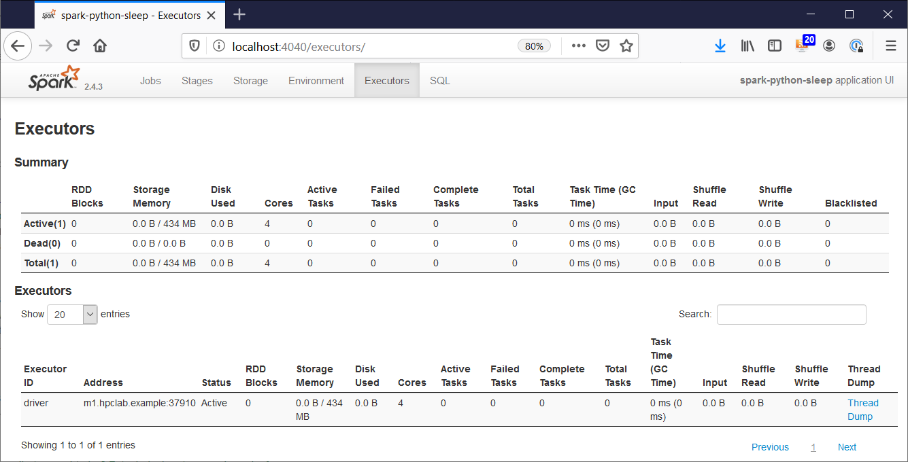
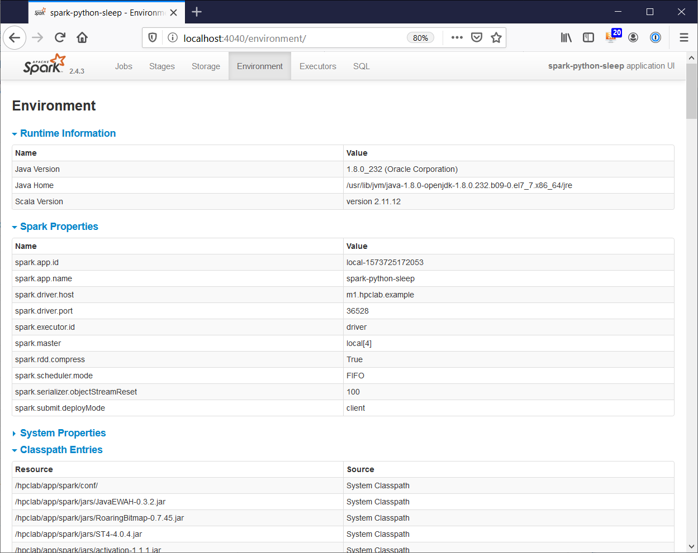

# Getting started with Spark running a simple Python script

Spark applications can run in local mode or on a Spark cluster. In this post I
explain and analyze how to run a small Python program in Spark local mode. See
my
[HPC Lab](http://www.beyond-storage.com/hpclab/)
for more
[Spark examples](https://www.beyond-storage.com/examples-spark).

---

As system administrator I am familiar with Python. For this exercise we run a
simple Python program
[spark-sleep-local.py](../spark-sleeps-local.py)
on Spark that just sleeps for a few minutes and then
exits. The pause allows to analyze which processes are running.

```
[ulf@m1 spark-simple]$ pwd
/hpclab/users/ulf/hpc-examples/spark-simple

[ulf@m1 spark-simple]$ cat spark-sleep-local.py
from pyspark.sql import SparkSession
from time import sleep

# Start local Spark instance - no session context provided
spark = SparkSession.builder.appName("spark-python-sleep").getOrCreate()

# Wait 5 minutes
minutes = 5
print("=====> Start: Sleep for (%i) minutes. <=====" % minutes)
sleep(minutes * 60)
print("=====> Stop: Sleep for (%i) minutes. <=====" % minutes)

# Stop local Spark instance
spark.stop()

[ulf@m1 spark-simple]$
```

[`SparkSession`](https://spark.apache.org/docs/latest/api/python/pyspark.sql.html#pyspark.sql.SparkSession)
establishes the connection to a Spark cluster. Though, `SparkSession` starts
a Spark instance in local mode, if no Spark cluster is specified.

---

In my setup Spark is installed under `/hpclap/app`. The Spark script
[`spark-submit`](https://spark.apache.org/docs/latest/submitting-applications.html)
launches Spark applications.

```
[ulf@m1 spark-simple]$ env | grep SPARK
SPARK_HOME=/hpclab/app/spark
SPARK_LOG_DIR=/hpclab/log/spark/logs
SPARK_WORKER_DIR=/hpclab/log/spark/work

[ulf@m1 spark-simple]$ which spark-submit
/hpclab/app/spark/bin/spark-submit

[ulf@m1 spark-simple]$
```

---

Let's run the Python sleep script on Spark. The `local[4]` tells SparkSession
to run up to four Spark Worker Threads in parallel.

```
[ulf@m1 spark-simple]$ spark-submit --master local[4] /hpclab/users/ulf/hpc-examples/spark-simple/spark-sleep-local.py
19/11/12 00:30:32 WARN NativeCodeLoader: Unable to load native-hadoop library for your platform... using builtin-java classes where applicable
Using Spark's default log4j profile: org/apache/spark/log4j-defaults.properties
19/11/12 00:30:33 INFO SparkContext: Running Spark version 2.4.3
19/11/12 00:30:33 INFO SparkContext: Submitted application: spark-python-sleep
19/11/12 00:30:34 INFO SecurityManager: Changing view acls to: ulf
19/11/12 00:30:34 INFO SecurityManager: Changing modify acls to: ulf
19/11/12 00:30:34 INFO SecurityManager: Changing view acls groups to:
19/11/12 00:30:34 INFO SecurityManager: Changing modify acls groups to:
19/11/12 00:30:34 INFO SecurityManager: SecurityManager: authentication disabled; ui acls disabled; users  with view permissions: Set(ulf); groups with view permissions: Set(); users  with modify permissions: Set(ulf); groups with modify permissions: Set()
19/11/12 00:30:38 INFO Utils: Successfully started service 'sparkDriver' on port 38882.
19/11/12 00:30:38 INFO SparkEnv: Registering MapOutputTracker
19/11/12 00:30:38 INFO SparkEnv: Registering BlockManagerMaster
19/11/12 00:30:38 INFO BlockManagerMasterEndpoint: Using org.apache.spark.storage.DefaultTopologyMapper for getting topology information
19/11/12 00:30:38 INFO BlockManagerMasterEndpoint: BlockManagerMasterEndpoint up
19/11/12 00:30:38 INFO DiskBlockManager: Created local directory at /tmp/blockmgr-f6af771f-b665-4b30-8d94-9a89050c0671
19/11/12 00:30:38 INFO MemoryStore: MemoryStore started with capacity 413.9 MB
19/11/12 00:30:38 INFO SparkEnv: Registering OutputCommitCoordinator
19/11/12 00:30:38 INFO Utils: Successfully started service 'SparkUI' on port 4040.
19/11/12 00:30:39 INFO SparkUI: Bound SparkUI to 0.0.0.0, and started at http://m1.hpclab.example:4040
19/11/12 00:30:39 INFO Executor: Starting executor ID driver on host localhost
19/11/12 00:30:39 INFO Utils: Successfully started service 'org.apache.spark.network.netty.NettyBlockTransferService' on port 37910.
19/11/12 00:30:39 INFO NettyBlockTransferService: Server created on m1.hpclab.example:37910
19/11/12 00:30:39 INFO BlockManager: Using org.apache.spark.storage.RandomBlockReplicationPolicy for block replication policy
19/11/12 00:30:39 INFO BlockManagerMaster: Registering BlockManager BlockManagerId(driver, m1.hpclab.example, 37910, None)
19/11/12 00:30:39 INFO BlockManagerMasterEndpoint: Registering block manager m1.hpclab.example:37910 with 413.9 MB RAM, BlockManagerId(driver, m1.hpclab.example, 37910, None)
19/11/12 00:30:39 INFO BlockManagerMaster: Registered BlockManager BlockManagerId(driver, m1.hpclab.example, 37910, None)
19/11/12 00:30:39 INFO BlockManager: Initialized BlockManager: BlockManagerId(driver, m1.hpclab.example, 37910, None)
19/11/12 00:30:41 INFO SharedState: Setting hive.metastore.warehouse.dir ('null') to the value of spark.sql.warehouse.dir ('file:/hpclab/users/ulf/hpc-examples/spark-simple/spark-warehouse').
19/11/12 00:30:41 INFO SharedState: Warehouse path is 'file:/hpclab/users/ulf/hpc-examples/spark-simple/spark-warehouse'.
19/11/12 00:30:42 INFO StateStoreCoordinatorRef: Registered StateStoreCoordinator endpoint
=====> Start: Sleep for (5) minutes. <=====
```

Now we have five minutes to investigate the environment.

---

Let's open a second shell and see which processes are running. Spark
instantiates one or more Java Virtual Machines (JVMs) on one or more nodes.
In local mode Spark instantiates one JVM only.

```
Last login: Tue Nov 12 00:01:21 2019 from 10.0.2.2

[ulf@m1 ~]$ jps
2708 SparkSubmit
25752 Jps

[ulf@m1 ~]$
```

All Spark processes are running in that JVM. The connection between the
different processes is via TCP/IP. The respective ports are documented in then
[Spark Security Guide](https://spark.apache.org/docs/latest/security.html#configuring-ports-for-network-security).

```
[ulf@m1 ~]$ lsof -i
COMMAND  PID USER   FD   TYPE DEVICE SIZE/OFF NODE NAME
java    2708  ulf  238u  IPv6  84834      0t0  TCP localhost:41007 (LISTEN)
java    2708  ulf  239u  IPv6  85086      0t0  TCP localhost:41007->localhost:sp-remotetablet (ESTABLISHED)
java    2708  ulf  267u  IPv6  85095      0t0  TCP m1.hpclab.example:38882 (LISTEN)
java    2708  ulf  268u  IPv6  85121      0t0  TCP *:yo-main (LISTEN)
java    2708  ulf  297u  IPv6  85132      0t0  TCP m1.hpclab.example:37910 (LISTEN)
python  2751  ulf    3u  IPv4  85085      0t0  TCP localhost:sp-remotetablet->localhost:41007 (ESTABLISHED)
python  2751  ulf    4u  IPv4  85133      0t0  TCP localhost:52758 (LISTEN)

[ulf@m1 ~]$
```

---

Spark comes with an in-built Web UI which is available on port 4040. My HPC Lab
is running on VirtualBox. Therefore I have configured port forwarding. This is
why the screenshots show URLs with localhost.




The other tabs just show blank pages. Initially I was disappointed about this,
but in a hindsight I understand that this is because the Python scripts is
just sleeping, but not doing any meaningful with Spark except starting and
stopping a local Spark instance. In the next blog post I will use a Python
script where we will see something meaningful in the other taps.

---

After the five minutes the Python scripts ends and the local Spark instance
will be shut down.

```
...
=====> Start: Sleep for (5) minutes. <=====
=====> Stop: Sleep for (5) minutes. <=====
19/11/12 00:35:42 INFO SparkUI: Stopped Spark web UI at http://m1.hpclab.example:4040
19/11/12 00:35:42 INFO MapOutputTrackerMasterEndpoint: MapOutputTrackerMasterEndpoint stopped!
19/11/12 00:35:42 INFO MemoryStore: MemoryStore cleared
19/11/12 00:35:42 INFO BlockManager: BlockManager stopped
19/11/12 00:35:42 INFO BlockManagerMaster: BlockManagerMaster stopped
19/11/12 00:35:42 INFO OutputCommitCoordinator$OutputCommitCoordinatorEndpoint: OutputCommitCoordinator stopped!
19/11/12 00:35:42 INFO SparkContext: Successfully stopped SparkContext
19/11/12 00:35:43 INFO ShutdownHookManager: Shutdown hook called
19/11/12 00:35:43 INFO ShutdownHookManager: Deleting directory /tmp/spark-b1233b45-cdfc-4b5c-adf1-9f98da3ca588
19/11/12 00:35:43 INFO ShutdownHookManager: Deleting directory /tmp/spark-82259db8-ba4b-47fa-8735-48e81baff9eb
19/11/12 00:35:43 INFO ShutdownHookManager: Deleting directory /tmp/spark-82259db8-ba4b-47fa-8735-48e81baff9eb/pyspark-83f42231-03bc-4108-8662-1df6398d26c8

[ulf@m1 spark-simple]$ jps
26338 Jps

[ulf@m1 spark-simple]$
```

---

This was a brief introduction in how to run a Python script in Spark local
mode. See my
[HPC Lab](http://www.beyond-storage.com/hpclab)
for more
[Spark examples](https://www.beyond-storage.com/examples-spark).

---
